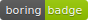
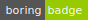

[](http://nikitas-dev-badges.s3-website-us-east-1.amazonaws.com/local-badges/build-status.svg) [](http://nikitas-dev-badges.s3-website-us-east-1.amazonaws.com/local-badges/coverage.svg)

# local-badges

A tool that generates badges locally from a customizable configuration file.

## Table Of Contents

* [How it works](#how-it-works)
* [Getting Started](#getting-started)
* [Examples](#example)
* [Valid badge styles](#valid-templates)
* [Available badges](#available-badges)

## How it works

local-badges is intended to be used as a CLI tool. Local-badges takes a javascript module which should be an object with a list of badges. it loops through your list of badges and generates a badge object according to your specifications. Then it uses the [gh-badges](https://www.npmjs.com/package/gh-badges) package to generate the badge svg, and saves the badge according to the name, and folder properties in your badge object.

Example:
```js
module.exports = {
  badges: [
    {
      name: 'my-badge', // required
      folder: './', // required
      colorA: 'yellow', // optional, defaults to gray
      colorB: 'red', // optional, defaults to lightgray
      template: 'plastic', // optional, defaults to flat
      text: ['boring', 'badge'], // optional, defaults to ['boring', 'badge']
    },
  ],
}
```

The above example will create a badge named my-badge.svg in the current working directory. It will look like this:

[](testFolder/yellow-red-plastic.svg)

The only argument local-badges looks for is `--config` which tells it where to find your badge configuration file (by default it looks for badgeConfig.js in your current working directory), but **any arguments you add to the local-badges command will be accessable via the cliObj that is passed to your badge functions**. An example of this can be seen in the [build-status badge](#example) in the example module.

## Getting started

You can either download the npm package
```sh
npm install -g local-badges
```

or you can clone the repository and do a symbolic link
```sh
git clone https://github.com/nikita-skobov/local-badges.git
cd local-badges
npm install --production
# use the --production flag to avoid installing devDependencies
# such as my eslint configuration, and jest.
# with --production it only installs 67 packages
# but without --production it installs 615 packages
npm link
# if you ever want to remove the symbolic link, just do
# npm unlink while inside the local-badges directory
```

Now you can use `local-badges` in your command line from any directory.
Let's look at an example:


## Example

The example command:
```sh
local-badges --config ./testFolder/testConfig.js --successFlag
```

The configuration file:
```js
// testFolder/testConfig.js
module.exports = {
  badges: [
    {
      // this badge will be made the same every time
      // because it uses static properties
      name: 'boring-badge',
      folder: './',
      colorA: '#aaa',
      colorB: '#bbb',
      text: ['boring', 'badge'],
    },
    {
      // this badge will be different depending on whether or not
      // you pass in a --successFlag option when running local-badges
      name: 'build-status',
      folder: './',
      fn: (cliObj) => {
        const colorB = cliObj.successFlag ? 'green' : 'red'
        const passOrFail = cliObj.successFlag ? 'passing' : 'failing'
        const text = ['build', passOrFail]
        return {
          colorA: 'gray',
          colorB,
          text,
        }
      },
    },
  ],

  // all badges will have the colorA property be purple unless the individual
  // badge object overrides the colorA property either as a static property
  // eg: boring-badge
  // or if the fn function returns a different colorA property
  // eg: build-status
  defaults: {
    colorA: 'purple',
  },
}
```

Running this command from the root of this repository will create 2 badges.
The first badge will be named `boring-badge.svg` and it will be placed in your current working directory, as specified by the folder property in the configuration object:
```js
{
  folder: './'
}
```
The second badge will be named `build-status.svg`, and will also be placed in your current working directory. the build-status badge has an extra property in the badge object called `fn`. `fn` is a function that takes a cli object that contains all the arguments passed in to local-badges. You can customize your badge configuration to depend on any argument you want other than `--config` because local-badges uses `--config` to find your configuration file.

## Global defaults (as found in [lib/constants/defaults.js](./lib/constants/defaults.js)):
- format: 'svg'
- colorA: 'gray'
- colorB: 'lightgray'
- template: 'flat'
- text: ['boring', 'badge']

## Configuration file options

```js
module.exports = {
  defaults: { 
  // defaults: Object, optional. if no 'defaults' property is present
  // local-badges will use the global defaults
  // any defaults you specify here will override the global defaults.
  },

  badges: [
  // badges: Array, required. Must contain at least one object
  ],
}
```

## valid defaults properties:

format: (the output file format)
  - optional
  - string
  - can only be 'svg' for now

colorA: (the color for the left side of the badge)
  - optional
  - string
  - can be any 3 or 6 character hex code (with or without a #)
  - can also be [any valid color word](#valid-color-words)

colorB: (the color for the right side of the badge)
  - optional
  - string
  - can be any 3 or 6 character hex code (with or without a #)
  - can also be [any valid color word](#valid-color-words)

template: (the badge appearance)
  - optional
  - string
  - can only be one of: [the valid templates](#valid-templates)

text: (the text on the badge)
  - optional
  - array
  - must have 2 elements
  - both element must be strings
  - if you want a badge that is a single color, you can make the first element be an empty string.

## valid badge object properties:

All of the properties from the defaults object above can also be included in your badge object(s) to override the defaults specifically for that badge. In addition to the default properties, the badge object also takes the following properties:

name: (the name of the file to be output)
  - required
  - string
  - the format extension will be appended automatically

folder: (the path or name of the folder where this badge will go)
  - required
  - string

fn: (a function that gets invoked by the badgeRunner that lets you customize your badge dynamically via the inputs from the command line)
  - optional
  - function
  - takes one parameter: the cli object containing all command line arguments
  - must return an object
  - any properties in the returned object will override your badge configuration specifically for this badge.


## valid-templates

- flat
  - [](./testFolder/flat-green.svg)
- popout
  - [](./testFolder/popout-green.svg)
- default
  - [](./testFolder/default-green.svg)
- plastic
  - [](./testFolder/plastic-green.svg)
- popout-square
  - [](./testFolder/popout-square-green.svg)
- flat-square
  - [](./testFolder/flat-square-green.svg)
- for-the-badge
  - [](./testFolder/for-the-badge-green.svg)
- social
  - [](./testFolder/social-green.svg)

The configuration file used to generate these template examples can be found [in testFolder/templateExamples.js](./testFolder/templateExamples.js)

## valid-color-words

In addition to using any 3 or 6 character hex code, you can use these color words which map to a hex code for you:
```
brightgreen: '#4c1',
green: '#97ca00',
yellow: '#dfb317',
yellowgreen: '#a4a61d',
orange: '#fe7d37',
red: '#e05d44',
blue: '#007ec6',
grey: '#555',
gray: '#555',
lightgrey: '#9f9f9f',
lightgray: '#9f9f9f',
critical: '#e05d44',
important: '#fe7d37',
success: '#4c1',
informational: '#007ec6',
inactive: '#9f9f9f',
```

These are the most common colors used in badges. If you want to use different color words, see [the colorWords.js file](./lib/constants/colorWords.js) for a full list.


## Available badges

local-badges is just a tool that generates badges from a configuration file. It does not come with any specific badge configurations. You can either make your own, or you can find some in the [list of available badges](BADGE_CONFIGURATIONS.md)

If you would like to add your custom badge configuration to that list, please follow the directions in [the contribution guidelines](CONTRIBUTING.md) and I will be more than happy to add your badge to the list.
